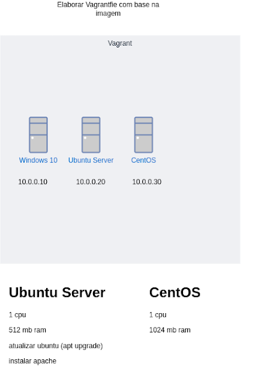
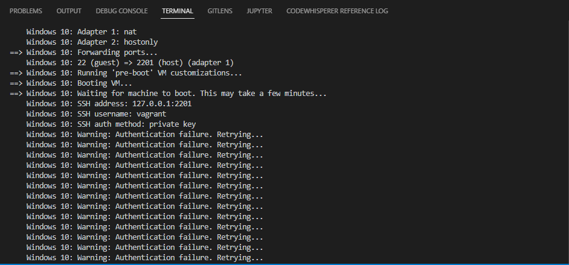
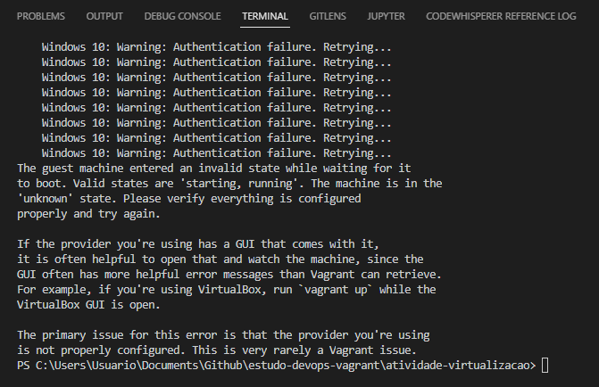
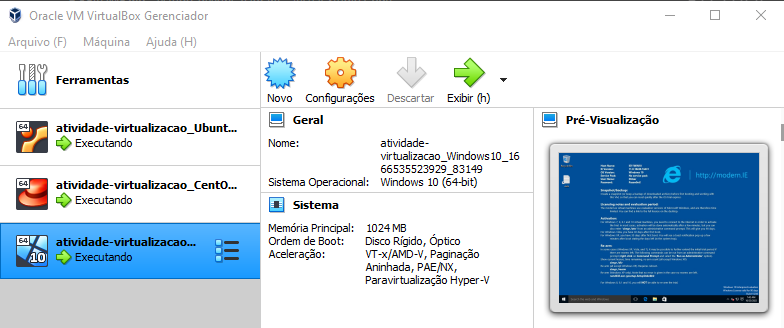

## Atividade MBA: Virtualização



Código-fonte que resolve a atividade em [`./Vagrantfile`](./Vagrantfile).

* Abrir o terminal no diretório `/atividade-virtualizacao`;
* Executar o comando;
```ruby
vagrant up
```
* Aguardar o download dos boxes das 3 máquinas virtuais (leva certca de 10 minutos);
* Checar no Virtual Box se as máquinas foram criadas corretamente;
* Destruir as máquinas executando o comando:
```ruby
vagrant destroy
```

#### Erros

Durante a execução do comando `vagrant up`, os servidores Ubuntu e CentOS são criados e a conexão é estabelecida com sucesso, mas na etapa de criação do Windows Server, a máquina é criada e o boot é feito com sucesso, porém, o vagrant não consegue estabelecer conexão, ocorrendo timeout.




No VirtualBox, entretanto, a máquina é criada normalmente, iniciada, e é possível fazer a conexão manualmente.



Por conta disso, no arquivo `VagrantFile` a criação da máquina Windows foi deixada por último, porque caso fosse configurada primeiro, o erro de conexão impediria a criação das máquinas CentOS e Ubuntu Server.
